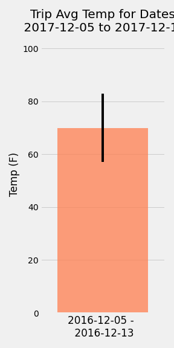
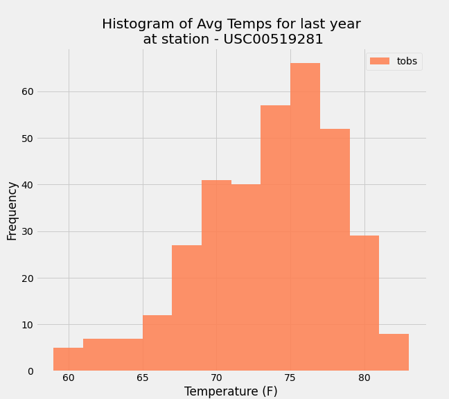
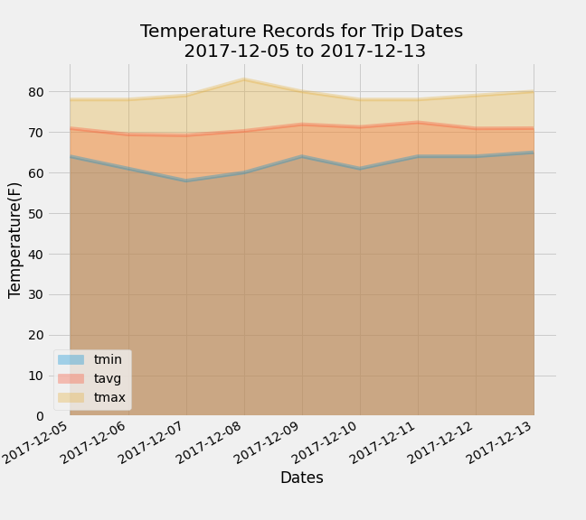

# sqlalchemy-challenge
CLIMATE ANALYSIS.  Climate exploration and analysis using SQLAlchemy.

# SQLAlchemy - Hawaii Weather.

Climate Analysis using SQLAlchemy and Python - climate_analysis.ipynb

Step 1 - Climate Analysis and Exploration
To begin, use Python and SQLAlchemy to do basic climate analysis and data exploration of your climate database. All of the following analysis should be completed using SQLAlchemy ORM queries, Pandas, and Matplotlib.

# Set-up:
Used SQLAlchemy create_engine to connect to your database.
Used SQLAlchemy automap_base() to reflect your tables into classes and save a reference to those classes called Station and Measurement.
Precipitation Analysis
Designed a query to retrieve the last 12 months of precipitation data.
Filtered only the date and prcp values.
Loaded the query results into a Pandas DataFrame and set the index to the date column.
Sorted the DataFrame values by date.
Plot the results using the DataFrame plot method.
Used Pandas to print the summary statistics for the precipitation data.

